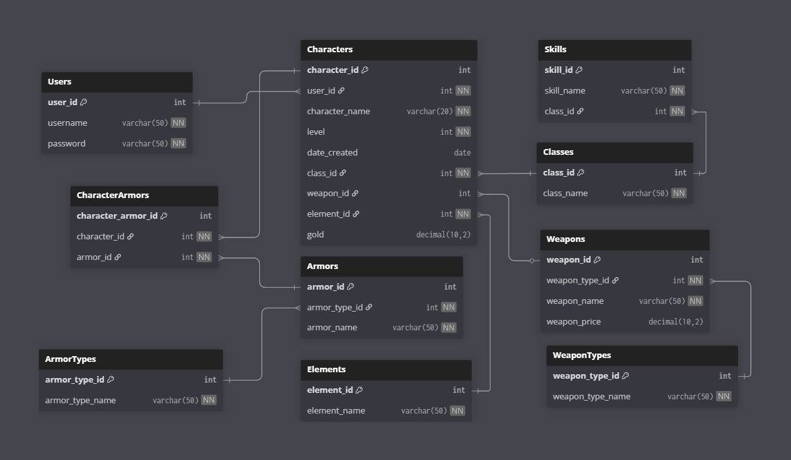

# Videogame RPG Character Database

## About  
The Videogame RPG Character Database is a SQL Server project that models a role-playing game system.  
It demonstrates core database development skills—including schema design, stored procedures, triggers, views, and role-based security—applied in a practical, game-themed context.  

---

## Introduction  

This project is a fully featured **SQL Server RPG database** that demonstrates how to design, build, and manage a role-playing game character system using SQL. It covers core database development concepts such as schema design, stored procedures, triggers, views, functions, and role-based security.  

The database models how a videogame might store and manage character data, including statistics, equipment, and skills. It also incorporates professional SQL development practices such as auditing with triggers, simplifying queries through views, and managing permissions with roles.  

Key skills demonstrated include:
- Designing normalized schemas to represent complex entities and relationships.  
- Writing stored procedures and functions to encapsulate business logic.  
- Using triggers and logs to ensure data integrity and track changes.  
- Creating views to present clean abstractions of underlying data.  
- Implementing role-based security for controlled database access.  
- Handling data import/export with CSV files for testing and population.  

This repository serves as a portfolio-ready example of SQL expertise applied to a practical, game-themed database project.  

---

## Table of Contents

- [Overview](#overview)  
- [Database Objects & Features](#database-objects--features)  
- [Key SQL Skills Demonstrated](#key-sql-skills-demonstrated)  
- [Setup & Usage](#setup--usage)  
- [Scripts Overview](#scripts-overview)  
- [License](#license)

---

## Overview

This project models a videogame RPG character system using SQL Server (MSSQL). It implements a fully functional schema, enriched with stored procedures, functions, views, triggers, and role-based access controls. Together, these components enable creation, modification, querying, and management of characters and their equipment, all while managing permissions and ensuring data integrity.

---

---

## ER Diagram

---

## Database Objects & Features

- **Schema Creation**
  - `CreateDatabase.sql`: Bootstraps the database environment, including tables for characters, armor, skills, and logs.
  - `UsersAndRoles.sql`: Defines user roles and permissions to enforce secure access.

- **Character Management**
  - `CreateCharacterSP.sql`: Stored procedure for adding new characters.
  - `CharacterDeletionLog.sql`: Tracks deletions via an audit log.
  - `DeletionTrigger.sql`: Trigger to log character deletions.

- **Inventory & Equipment**
  - `EquipArmorSP.sql`: Stored procedure to equip armor on characters.

- **Data Manipulation (DML)**
  - `DMLQueries.sql`: Demonstrates data updates, inserts, and deletes for schema validation.

- **Views & Query Abstractions**
  - `ViewCharactersView.sql`: Presents character summaries.
  - `ViewCharactersFunction.sql`: Function to retrieve character details.
  - `ViewCharacterArmorView.sql`: Shows armor equipped per character.

- **Business Logic & Computation**
  - `GetCharacterSkillsFunction.sql`: Function to fetch and compute character skills.

- **Legacy / Versioning**
  - `CreateCharacter - OUTDATED.sql`: Earlier iteration of character creation logic.

- **Data Exports**
  - `CSV Files` folder: Sample data in CSV format for testing.

---

## Key SQL Skills Demonstrated

| **Skill Area**                | **Details** |
|-------------------------------|-------------|
| **Schema Design**             | Structured tables and relationships to model RPG entities and interactions. |
| **T-SQL Programming**         | Advanced use of stored procedures (`SP`), functions, and control flow. |
| **Views & Functions**         | Abstraction of `SELECT` logic for cleaner queries and reusability. |
| **Triggers & Auditing**       | Trigger-based logging to monitor data deletions and maintain integrity. |
| **Role-Based Security**       | Definition of users and roles in SQL to control access and permissions. |
| **Data Manipulation**         | Comprehensive DML examples covering inserts, updates, and deletes. |
| **Version Control Awareness** | Inclusion of outdated scripts to reflect refactoring and iteration. |
| **Data Import/Export**        | Organized CSVs ready for bulk load or testing. |

---

## Setup & Usage

1. **Initialize the database**  
   Run `CreateDatabase.sql` to generate tables, default data, and supporting structures.

2. **Create users and assign roles**  
   Execute `UsersAndRoles.sql` to institute access control.

3. **Use stored procedures for transactions**  
   - `CreateCharacterSP.sql` to add new characters.  
   - `EquipArmorSP.sql` to assign items to characters.

4. **Audit deletions**  
   Deletions trigger `DeletionTrigger.sql`, which logs entries into `CharacterDeletionLog.sql`.

5. **Query via views & functions**  
   - `ViewCharactersView.sql` for an overview of characters.  
   - `ViewCharacterArmorView.sql` for equipment details.  
   - `GetCharacterSkillsFunction.sql` for computed skill data.

6. **Use DML examples**  
   `DMLQueries.sql` contains sample modifications to interact with the schema.

7. **Load or export sample data**  
   Use CSVs for populating or extracting data as needed.

---

## Scripts Overview

- **Initialization**  
  - `CreateDatabase.sql` – Set up core schema.  
  - `UsersAndRoles.sql` – Configure security.

- **Stored Procedures**  
  - `CreateCharacterSP.sql` – Insert new characters.  
  - `EquipArmorSP.sql` – Manage equipment assignments.

- **Triggers & Logging**  
  - `DeletionTrigger.sql` – Activate logging on deletion.  
  - `CharacterDeletionLog.sql` – Stores deletion logs.

- **Logic Functions & Views**  
  - `ViewCharactersView.sql` – Character listing.  
  - `ViewCharacterArmorView.sql` – Equipment lookup.  
  - `GetCharacterSkillsFunction.sql` – Skill retrieval logic.  
  - `ViewCharactersFunction.sql` – Character detail function.

- **DML Samples**  
  - `DMLQueries.sql` – CRUD examples.

- **Legacy**  
  - `CreateCharacter - OUTDATED.sql` – Previous character creation procedure.

- **Data Samples**  
  - CSV files for input/output.

---

## License

- **MIT License** – Free to use and modify. ([github.com](https://github.com/woby555/VideogameRPG_Database))
